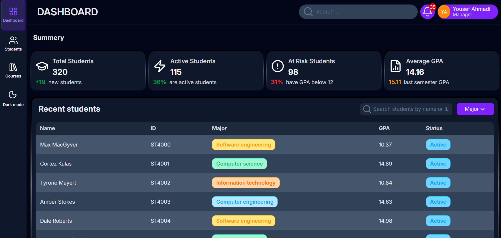
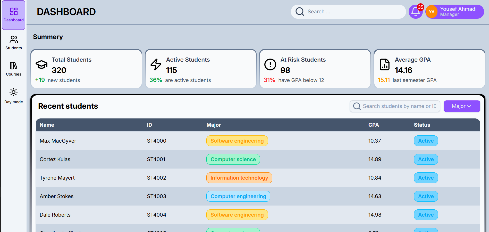
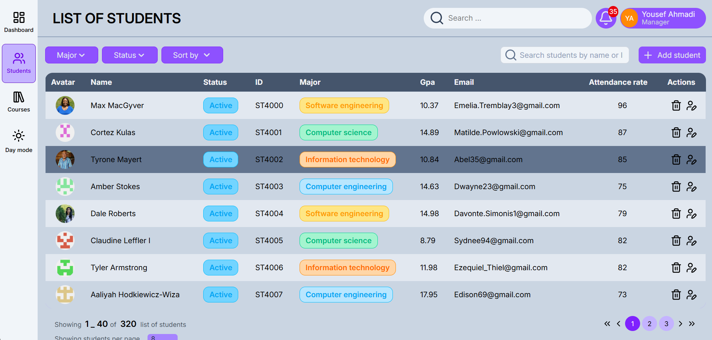
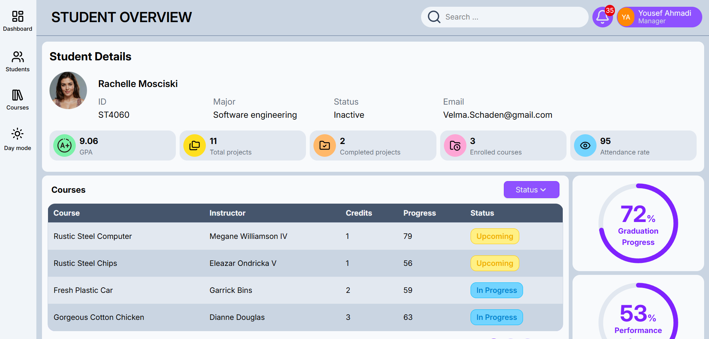
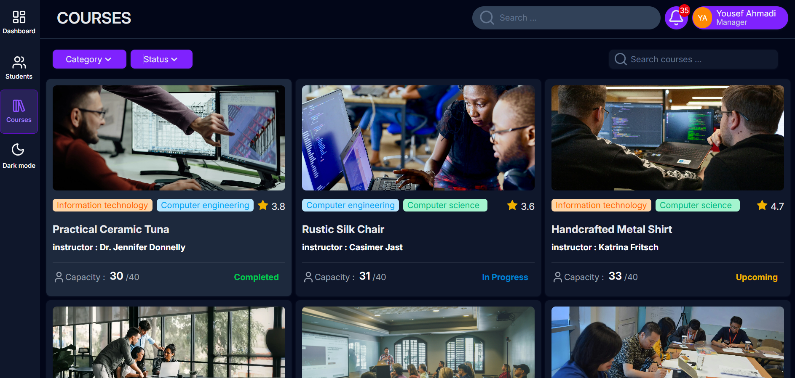
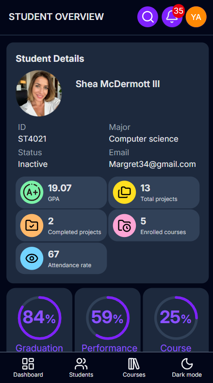

# 🎓 Dashboard Management

A modern and responsive **Student Management Dashboard** built with **React**, **Vite**, and **Bootstrap**.  
The project provides an intuitive interface for managing students, courses, and academic statistics with support for both **Light** and **Dark** themes.

---

## ✨ Features

- 📊 Dashboard with summary statistics
- 👨‍🎓 Student management
- 📄 Student profile & overview
- 📚 Course management
- 🔍 Search and filtering
- 🌙 Light / Dark Mode
- 📱 Responsive design
- ⚡ Fast development using Vite
- 🔄 Data fetching with React Query
- ✅ Form validation using React Hook Form & Yup

---

## 🛠 Tech Stack

- React
- Vite
- Bootstrap 5
- React Query
- React Router DOM
- React Hook Form
- Yup
- Axios

---

## 📷 Screenshots

### Dashboard (Dark)



### Dashboard (Light)



### Students List



### Student Overview



### Courses



### Mobile View



---

## 📁 Project Structure

```text
src
│
├── components
├── layouts
├── pages
├── hooks
├── context
├── services
├── constants
├── data
├── assets
└── utils
```

---

## 🚀 Getting Started

Clone the repository

```bash
git clone https://github.com/yousefahmadi2600-design/Dashboard-Management.git
```

Install dependencies

```bash
npm install
```

Run development server

```bash
npm run dev
```

Build project

```bash
npm run build
```

---

## 🎯 Pages

- Dashboard
- Students List
- Student Overview
- Courses

---

## 📌 Future Improvements

- Authentication
- Role-based Access Control
- Real Backend Integration
- CRUD Operations
- Charts & Analytics
- Notifications
- Unit Testing

---

## 👨‍💻 Author

**Yousef Ahmadi**

GitHub:
https://github.com/yousefahmadi2600-design

---

## ⭐ Support

If you like this project, consider giving it a **Star ⭐** on GitHub.
