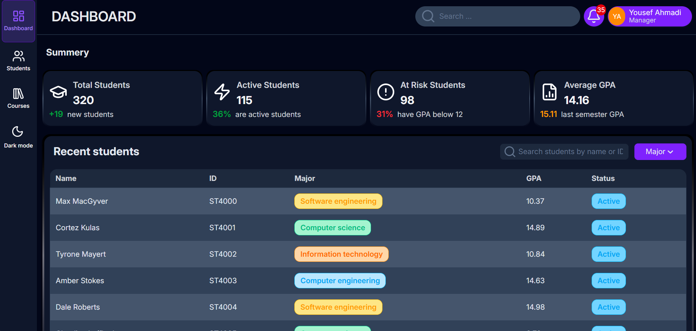
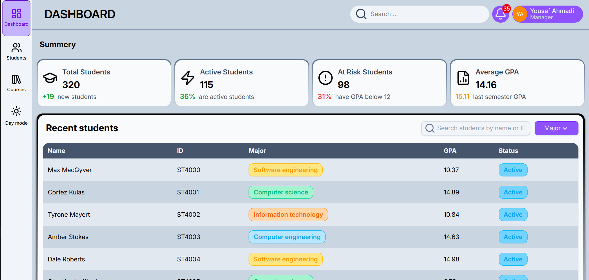
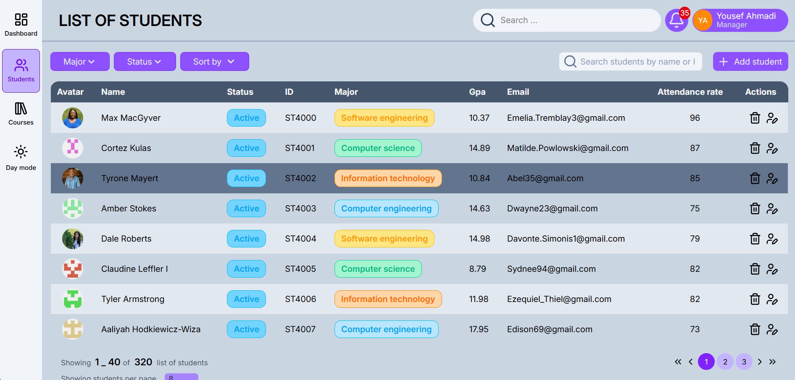
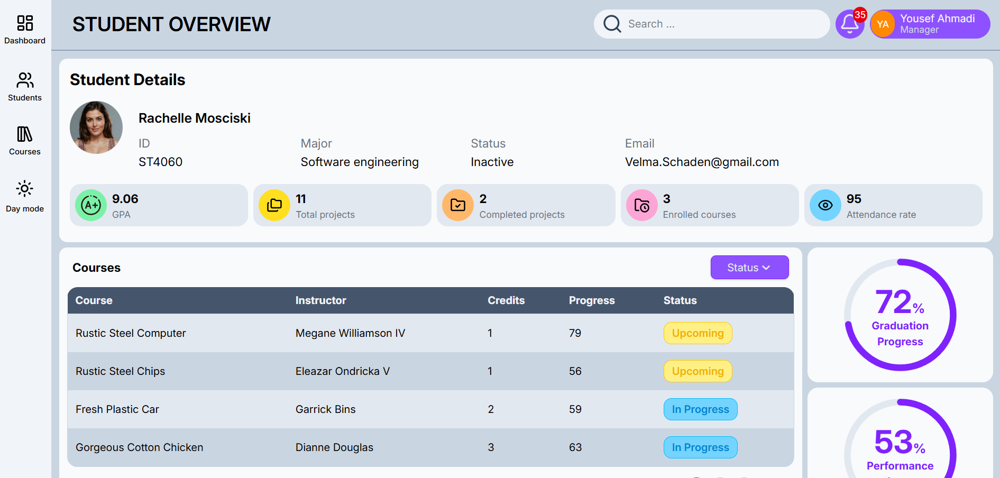
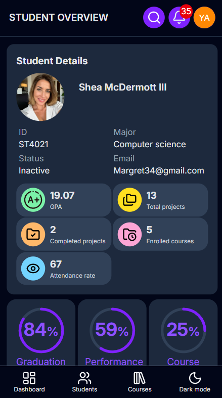

# 🎓 Management Dashboard

A modern and responsive **Student Management Dashboard** built with **React** and **Vite**. This project provides an intuitive interface for managing student information, viewing statistics, and monitoring academic data through a clean and user-friendly dashboard.

---

## 🌐 Live Demo

🔗 https://dashboard-management-taupe.vercel.app

---

## ✨ Features

- 📊 Dashboard with statistical overview
- 👨‍🎓 View student information
- ➕ Add new students
- ✏️ Edit student information
- 🗑️ Delete students
- 🔍 Search students
- 🎯 Filter students
- 📄 Pagination
- 👤 Student details page
- 📚 Course information
- 🌙 Dark Mode
- 📱 Responsive Design
- 🔔 Toast Notifications
- 🪟 Modal Dialogs
- ✅ Form Validation
- ⚡ Dynamic Routing
- 🧩 Reusable Components
- 💀 Loading Skeletons
- 🚨 Error Handling

---

## 🛠️ Tech Stack

### Frontend

- React
- Vite
- JavaScript
- Tailwind CSS

### Libraries

- React Router DOM
- React Hook Form
- Yup
- Context API
- Lucide React
- React Hot Toast

### Mock Data

- Faker.js

### Development Tools

- npm
- Prettier

### Deployment

- Vercel

---

## 📌 Project Overview

This project is designed for administrators to manage student information efficiently.

The dashboard allows administrators to:

- View student information
- Add new students
- Edit existing students
- Delete students
- View detailed student profiles
- Browse course information
- Search and filter students
- Monitor dashboard statistics

> **Note:** This project does not use a backend API. All data is generated locally using **Faker.js**.

---

## 📷 Screenshots

### Dashboard (Dark)



### Dashboard (Light)



### Students List



### Student Overview



### Courses


### Mobile View

## 

## 📂 Project Structure

```text
Management-Dashboard/
├── public/
├── screenshots/
├── src/
│   ├── assets/
│   ├── components/
│   ├── constants/
│   ├── context/
│   ├── data/
│   ├── hooks/
│   ├── layouts/
│   ├── pages/
│   ├── pagination/
│   ├── App.jsx
│   └── main.jsx
├── package.json
├── vite.config.js
└── README.md
```

---

## 🚀 Installation

Clone the repository

```bash
git clone https://github.com/yousefahmadi2600-design/Dashboard-Management.git
```

Go to the project directory

```bash
cd Dashboard-Management
```

Install dependencies

```bash
npm install
```

Start development server

```bash
npm run dev
```

---

## 📄 Available Pages

- Dashboard
- Students
- Student Details
- Courses

---

## 📌 Future Improvements

- Backend API integration
- Authentication & Authorization
- Database support
- Charts and Analytics
- Export Data (Excel/PDF)
- User Roles & Permissions

---

## 👨‍💻 Author

**Yousef Ahmadi**

GitHub

https://github.com/yousefahmadi2600-design

---

## ⭐ Support

If you like this project, consider giving it a **⭐ Star** on GitHub.

---

## 📄 License

This project is licensed under the MIT License.
